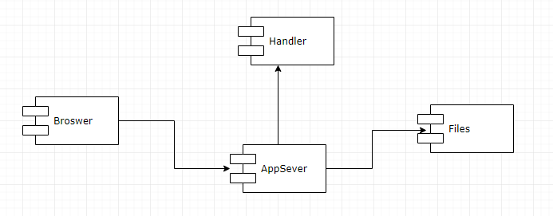
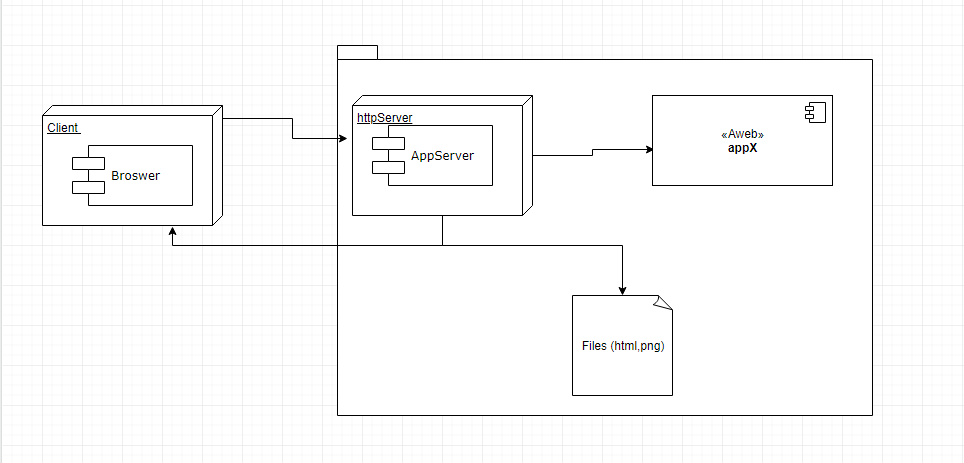
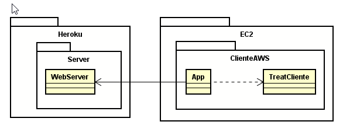
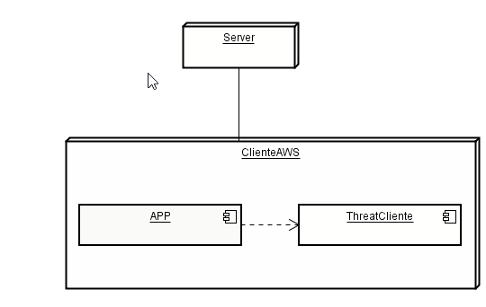

# Taller de Introducción a AWS
# 2019-2  Arquitectura empresarial Grupo: 1

# Profesor
## Luis Daniel Benavides Navarro, Ph.D. 

# Integrante
## Juan Pablo Ospina Henao

# Heroku app
[Servidor Juan Ospina](https://salty-river-29279.herokuapp.com/)

# Descripción del laboratorio
### Descripción 

En este artículo tiene como objetivo la construcción de un servidor Web concurrente (tipo apache) en Java y 
la elaboración de un cliente que permita realizar peticiones al servidor de forma concurrente. El servidor 
debe tener ciertos requisitos como ser capaz de entender páginas HTML e imágenes. Además de eso el servidor 
debe proveer un framework IoC para la construcción de aplicaciones a partir de POJOS. Para este caso se tendrá
 una aplicación básica de calculadora la cual podremos realizar actividades de suma, resta, multiplicación, 
 división y potencia. Además de ver la funcionalidad de la aplicación pasaremos a explicar dos modelos 
 importantes para el desarrollo de cualquier aplicación los cuales son arquitectura de software y arquitectura
  de despliegue. Estas herramientas nos permitirán ver de mejor forma la composición 
 del software. Y por último se tendrá un espacio para ver el enlace a Heroku el cual explicaremos todas las 
 funcionalidades del software. Además de ello se realizará el cliente de forma que llame repetidas veces al servidor 
 siempre y cuando lo haga de manera concurrente.

# Diseño
## Arquitectura
### modelo de software

### modelo de despliegue

### Arquitectura AWS

### modelo Cliente

## Compile and run instructions

* Para ejecutar empaquetar:
mvn package

* si se desa ver realizar la documentacion del codigo
mvn javadoc:javadoc

